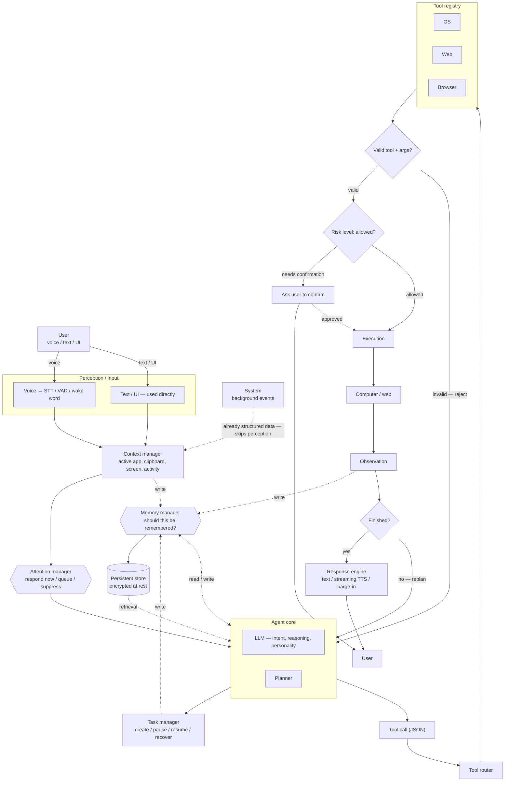

# Heisenberg V2 — Complete Architecture (corrected)

This is the fully corrected version, folding in the four fixes and their actual
rationale: raw sensory input goes through Perception, but structured system events
skip straight to Context; Memory Manager is drawn as an explicit gatekeeper with
write access from Agent, Context, and Task Manager, not a passive store; Tool
Validation and Safety are two separate stages with two separate failure paths; and
the agent loop actually loops — Observation feeds a Finished? check that can send
control back to Agent Core to replan.



*(Renders in GitHub, VS Code with a Mermaid extension, or any Mermaid-compatible viewer.)*

## Module notes

**User vs. system input** — voice goes through STT/VAD/wake word; typed or UI input
is used as-is. Background events (a crashed process, a timer firing) are already
structured data — they skip Perception entirely and go straight to Context, since
there's nothing to sense or transcribe.

**Context manager** — unchanged: active app/window, clipboard, screen context,
recent activity. Receives from both the perception/input path and directly from
system events.

**Attention manager** — every trigger, user or system, passes through here before
reaching the agent. It decides: interrupt now, queue for after the current
interaction, or suppress (e.g. don't announce a new email mid-call).

**Agent core (LLM + planner)** — reasoning, intent, personality, and planning live
here. It reads from Memory Manager for context and writes back through it — it
never touches the persistent store directly.

**Task manager** — tracks multi-step task state (created, paused, resumed,
recovered) separately from the Planner, so a crash mid-task doesn't force a
full re-plan from scratch — you can resume where you left off.

**Memory manager (now explicit)** — the actual gatekeeper, not a passive store.
Agent, Context, and Task Manager all write *through* it, and it decides what's
actually worth persisting rather than dumping every transcription and screen frame
into the database. This is what makes "remember that I prefer VS Code" work even
when there's no tool execution behind it.

**Tool call → Validation → Safety (now separate)** — two different questions,
two different stages. Validation asks "is this a real, registered tool with valid
arguments?" and rejects hallucinated or malformed calls immediately, sending
control back to the agent rather than letting them reach risk assessment at all.
Safety only ever sees requests that already passed validation, and asks "is this
tool allowed to do this?" — escalating to a user confirmation when needed.

**Execution → Computer/Web → Observation** — same as before: the action runs, and
results, screen changes, and errors come back as Observation.

**The actual loop (this was missing before)** — Observation feeds a Finished?
check. If the task isn't done, control goes back to Agent Core to replan with the
new information, instead of the pipeline ending after one pass. This is the
difference between a command executor and a real agent — "research laptops,
compare them, recommend one" needs several passes through this loop before
Finished? says yes.

**Response engine** — text, streaming TTS, and barge-in, closing the loop back to
the user — reached either directly (task finished) or via a confirmation request
mid-flow.

**Cross-cutting concerns** (not pipeline stages, so left off the diagram to avoid
clutter): Self-Diagnostics checks CPU/RAM/mic/model/service health; Observability
logs latency, tool history, and errors; Performance Optimization covers
quantization, caching, and GPU/CPU routing. All three touch Agent Core and
Execution but don't sit in the request flow itself.

## Detail views

These expand on single boxes from the main diagram above. They don't change the
core pipeline — they just zoom into how two specific nodes are internally
organized.

### Web tools vs. browser tools (detail of Tool Registry → Web / Browser)

Kept as two separate tool families rather than one, so a research request doesn't
need to open a browser:

```text
                    AGENT CORE
                        │
                 ┌──────┴──────┐
                 │             │
                 ▼             ▼
             WEB TOOLS     BROWSER TOOLS
                 │             │
          Search / Retrieve   Navigate / Click
          Extract / Research  Type / Inspect
                 │             │
                 └──────┬──────┘
                        ▼
                  Tool results → Agent Core
```

"Research the latest Qwen model" stays in Web Tools. "Open the Qwen site and
download it" escalates into Browser Tools. Both still pass through the same
Validation → Safety stages from the main diagram — this detail view doesn't skip
that.

### Model router (detail of Agent Core → LLM)

For the hybrid local/cloud feature — local by default, cloud only with your
explicit per-query approval:

```text
                    USER REQUEST
                         │
                         ▼
                  MODEL ROUTER
                         │
             ┌───────────┴───────────┐
             │                       │
             ▼                       ▼
        LOCAL MODEL             CLOUD MODEL
        (default — private,     (opt-in only —
         normal tasks)           hard reasoning)
             │                       │
             └───────────┬───────────┘
                         ▼
                     AGENT CORE
```

This sits in front of the LLM box in the main diagram — everything downstream
(Planner, Task Manager, Memory Manager, tool calls) behaves identically regardless
of which model answered.

## Feature-to-subsystem map

All 22 planned features, and where each one lives in the architecture above:

| # | Feature | Subsystem |
|---|---|---|
| 1 | AI Brain | Agent core (LLM) |
| 2 | Tool System | Tool router + registry |
| 3 | Permissions / Safety | Validation + safety engine |
| 4 | Advanced Memory | Memory manager |
| 5 | Web Research | Web tools |
| 6 | Browser Agent | Browser tools |
| 7 | Computer Control | OS tools + vision |
| 8 | Advanced Voice | Perception/input + response engine |
| 9 | Performance Optimization | Inference/runtime (cross-cutting) |
| 10 | Personality System | Agent core / response engine |
| 11 | Self-Diagnostics | System monitor (cross-cutting) |
| 12 | Task Manager | Task manager |
| 13 | AI Planning | Planner |
| 14 | Observability | Logging/telemetry (cross-cutting) |
| 15 | Vision / Screen Understanding | Perception/input |
| 16 | Context & Focus Awareness | Context manager |
| 17 | Proactive/Ambient Behavior | Background services + attention manager |
| 18 | Scheduling & Reminders | Scheduler (background services) |
| 19 | Background Service / Persistence | Runtime/daemon |
| 20 | Speaker Recognition | Perception/input (voice identity) |
| 21 | Hybrid Model Routing | Model router |
| 22 | Memory Encryption | Memory manager (persistent store) |
